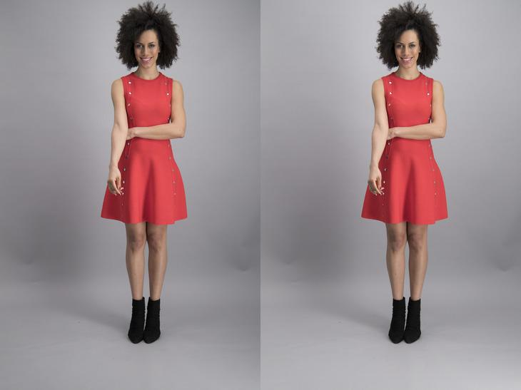
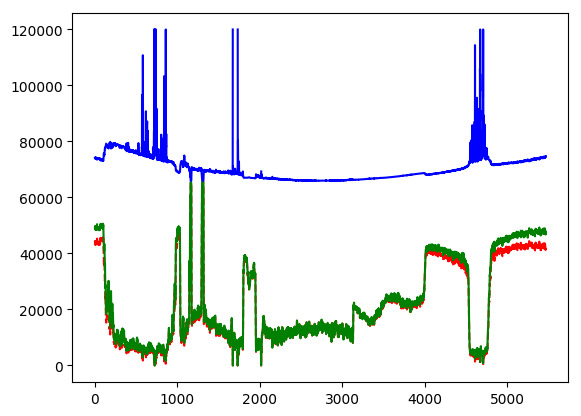
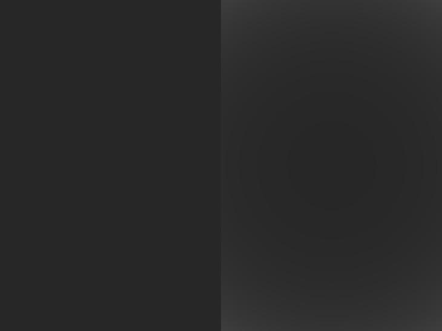
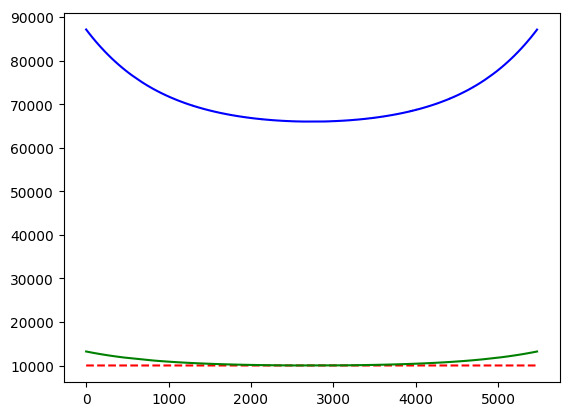

# devignetting for images and videos captured by various Canon camera models

### Intro

The extent of vignetting varies with lens settings, specifically focal length, aperture and focus. While applying de-vignetting, we should work with linear data (no gamma correction) because it makes a quantitative difference to the results since pixel intensity is scaled when correcting [vignetting](https://wiki.panotools.org/Vignetting). Since RAW images should contain linear sensor data, de-vignetting should be the first process in the raw conversion pipeline.

### Part I : Reverse-engineering PhotoShop’s de-vignetting filter

The idea is to estimate the vignetting falloff curve by observing the difference between a given RAW image before and after applying the filter in ACR, assuming that the curve can be estimated by a radial polynomial curve. Here is an example:

Where the devignetted image is on the right and the bottom graph is representing pixel intensities at the central column of the images (original image, de-vignetted image and de-vignetting gain image in red, green and blue, respectively). The images are in 16bits ( 0-65535) and the de-vignetting pixel intensities are scaled by 66000 for a better visualization of the de-vignetting factors on the same graph.

Due to pixel cutoff and rounding errors at dark regions (which results at high spikes on the gain image), fitting a polynomial function will be prone to big inaccuracy. To avoid these sources of inaccuracy, we decided to generate a synthetic gray RAW image.

It is possible to generate a DNG RAW image in LR but the result is not recognized by PS as a genuine image and PS does not offer the correct lens profile. The eventual solution was found through G’MIC tools as follows:

- - Create your tiff image (from your CR2 raw image, let’s call it _regularimage.tiff_)
    - Use _rgb2bayer_ from G’mic tools to generate the RAW image :

_$ gmic regularimage.tiff -mul 0.25 -adjust_colors 0,0,-100 -rgb2bayer 0 -o rawimage.tiff_

- - Use LR to convert _rawimage.tiff_ to DNG
    - Use exiftool to inject CR2 metadatato the DNG file (in order to have the same focal length, focus distance and aperture size)
    - Done! Now you have a raw file that has the same bayer RAW data as _regularimage.tiff_ and the same exif data as your CR2 image and PS offers all available profiles for lens correction.

Note 1: G’MIC does not provide a command line interface (CLI) for Mac (so the above command should be run on a Windows platform). For Mac, there exist so called GMIC-QT gui for GIMP but applying _rgb2bayer_ filter through this interface generates a tiff which has the same problem of not being recognized as a genuine RAW image by PS.

Now we have a clear curve:

The next step would be to try to fit a radial polynomial model to the blue curve but it turned out the PS is already providing the polynomial model coefficients as lens correction profiles shipped with the PS.

Useful links:

- <https://www.dpreview.com/forums/thread/3202472>
- <https://stackoverflow.com/questions/39373055/vignetting-correction-on-rgb-image-with-opencv?rq=1>
- <https://www.physics.mcmaster.ca/~syam/Photo/>
- <https://github.com/GUOYI1/Vignetting_corrector>
- [https://blogs.adobe.com/jkost/tag/the-adobe-lens-profile-creator-too](https://blogs.adobe.com/jkost/tag/the-adobe-lens-profile-creator-tool)
- <https://www.libraw.org/articles/bayer-moire.html>
- <https://discuss.pixls.us/t/how-to-create-synthetic-raw-image/4461/23>
- <https://www.dpreview.com/forums/thread/4171653>

### Part II : Understanding and applying PS’s lens correction profiles (LCP)

Adobe has a free tool called “Adobe Lens Profile Creator” for generating lcp profiles which include the estimation of aberration models for the most of camera/lens configurations ( Do not confuse with “Adobe DNG Profile Editor” which is a tool for creating camera, and not lens, profiles). For Canon, these profiles are accessible as XMP files at

_/Library/Application\\ Support/Adobe/CameraRaw/LensProfiles/1.0/Canon_

The explanations on the Adobe camera model, polynomial models (for [Distortion, CA, Vignetting](https://web.archive.org/web/20141111223926/https://forums.adobe.com/message/4754311#4754311)) and XMP entries are documented in the following pdf doc:

<http://download.macromedia.com/pub/labs/lensprofile_creator/lensprofile_creator_cameramodel.pdf>

The profiles are not provided for all and every lens configurations but for only a limited set of focal length, focus distance and aperture size tuples, meaning one needs to interpolate the appropriate parameters for unseen configurations. In an attempt to understand the way PS is using these lens profiles, I experimented with typical interpolation techniques (mainly nearest, linear and cubic) but none of them resulted in the reproduction of the gain curve, identical to PS. Imitating RawTherapee, the only open source raw converter with a lcp profile engine, way of interpolation does not result in any improvement neither.

Useful links:

- <https://web.archive.org/web/20141112035723/https://forums.adobe.com/community/labs/archives/lensprofile_creator/>
- <https://web.archive.org/web/20141111223926/https://forums.adobe.com/thread/1077832>
- <https://web.archive.org/web/20141117115215/http://forums.adobe.com/message/3267630>
- <https://www.imagemagick.org/discourse-server/viewtopic.php?t=18944>
- <https://code.google.com/archive/p/rawtherapee/issues/1343>

### Part III : If we do not need the exact behaviour of PS correction filter

Then we can benefit from tools such as Hugin to estimate vignetting model (as well as distortion and CA).

Useful links:

- <http://lensfun.sourceforge.net/calibration-tutorial/lens-vignetting.html>
- <http://wilson.bronger.org/lens_calibration_tutorial/>